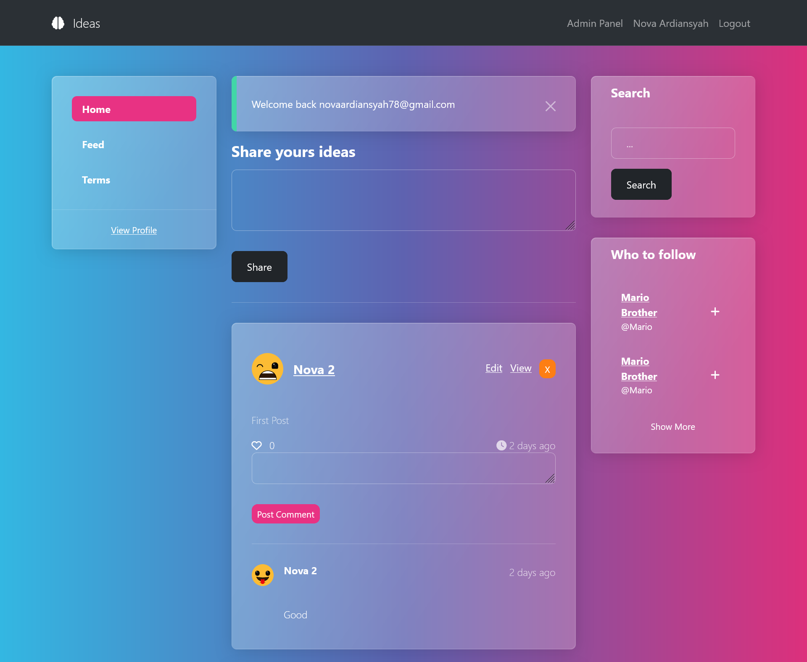
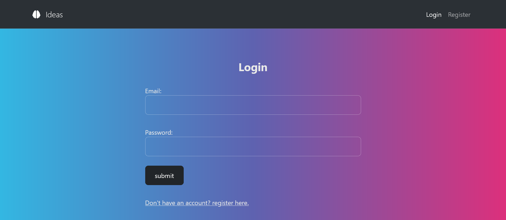
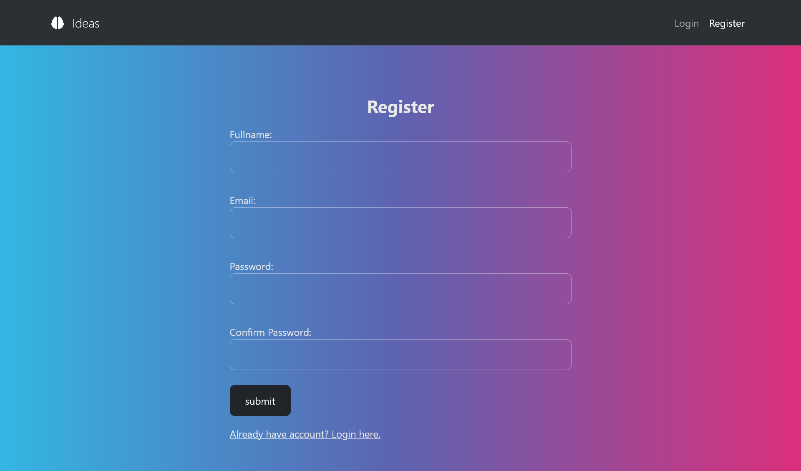
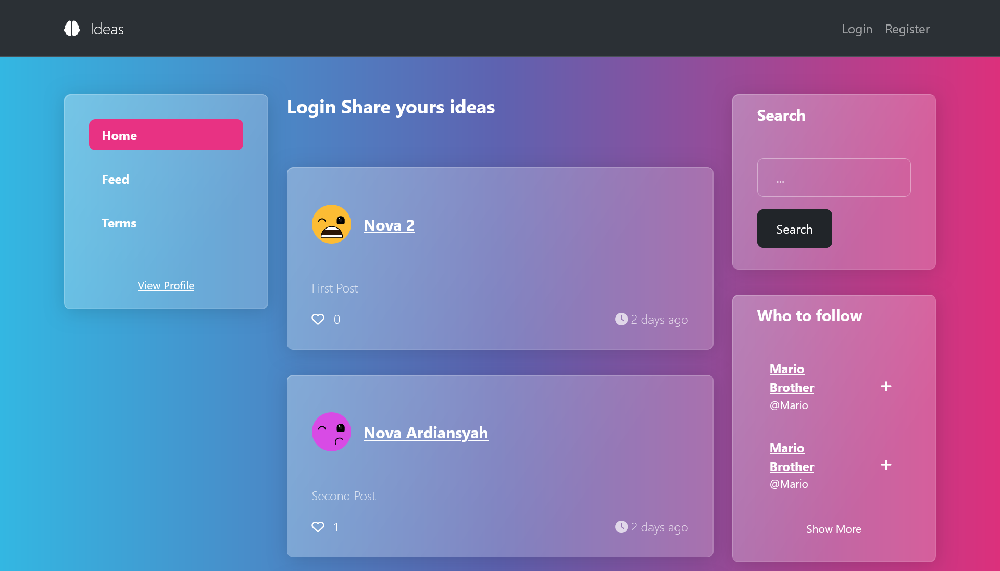

# Laravel 10 Crash Course

Hi Future Developer!

Welcome to my latest project, this time I am exploring a PHP framework that is quite popular in its class, Laravel. I plan to enhance my skills in application development to be faster, more efficient, and secure. For these reasons, I chose Laravel, as it comes with many wonders that can meet the expectations I mentioned earlier.

Developed with the latest version of PHP, Laravel stands out as one of the most modern frameworks, offering numerous new features not found in other PHP frameworks. Laravel also boasts a large community, so I feel confident that I won't face significant challenges during application development.

Security is one of the crucial aspects of application development, and Laravel excels in providing excellent security features. This assures me that I don't need to worry about the security of the applications I develop.

*Thank you for your interest. Happy coding!*

## ✨ Features:

- **Authentication**
- **Authorization** 
- **CRUD**
- **Database Migration**
- **Eloquent ORM**
- **Form Validation**
- **Middleware**
- **Model-View-Controller (MVC)**
- **Routing**
- **Session**
- **Templating Engine**

## Powering Up with an Electrifying Tech Stack! ⚡

This project is fueled by an electrifying lineup of cutting-edge technologies:

- **[Laravel v10](https://laravel.com/)**
- **[PHP v8.0.2](https://www.php.net/)**
- **[Bootstap v5](https://getbootstrap.com/)**

Prepare for an exhilarating ride through innovation and efficiency with this impressive tech stack!

## Licensing Groove🕺

Exciting news! This project is grooving to the rhythm of the [MIT License](https://github.com/novaardiansyah/genius-ai-generator/blob/main/LICENSE)! 🎉

## Let's Connect! 📞

Need to chat? Feel free to drop me a line via [Email](mailto:novaardiansyah78@gmail.com) or hit me up on [WhatsApp](https://wa.me/6289506668480?text=Hi%20Nova,%20I%20have%20a%20question%20about%20your%20project%20on%20GitHub:%20https://github.com/novaardiansyah/genius-ai-generator). I'm just a message away, ready to groove with you! 📩

## Sneak Peek 🌟

Get a glimpse of the app's enchanting world by exploring the current progress at [demo is not available](). Feast your eyes on these snapshots that showcase the app's dynamic essence:

  
  

  
  
  
